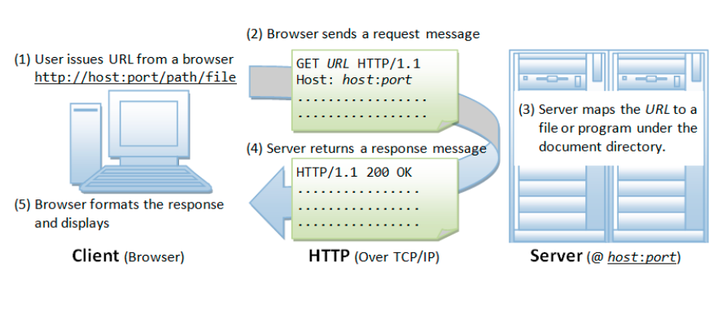
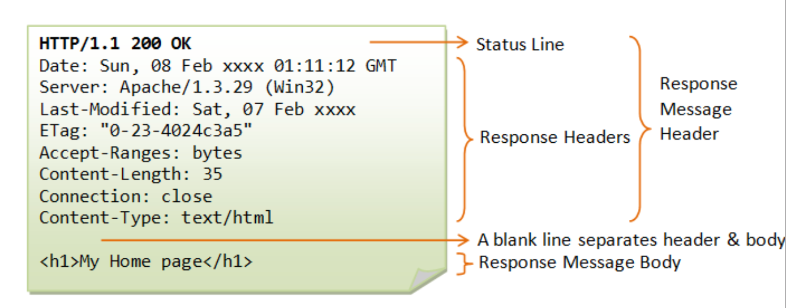
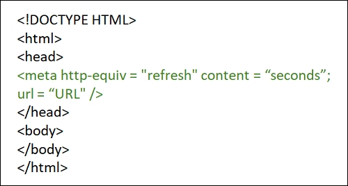
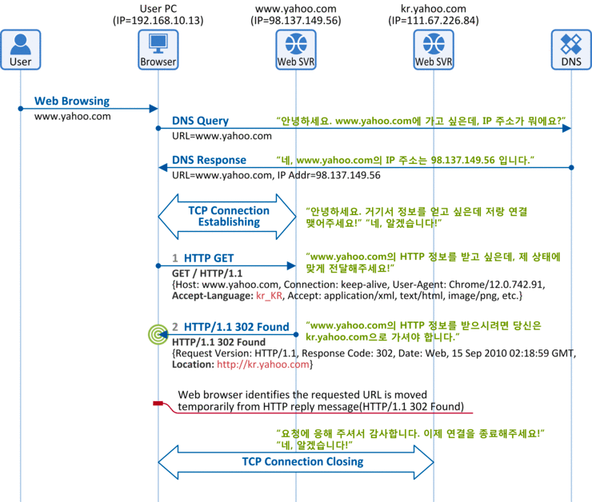
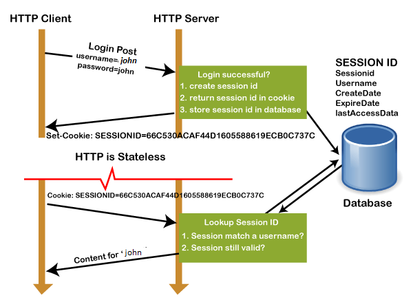
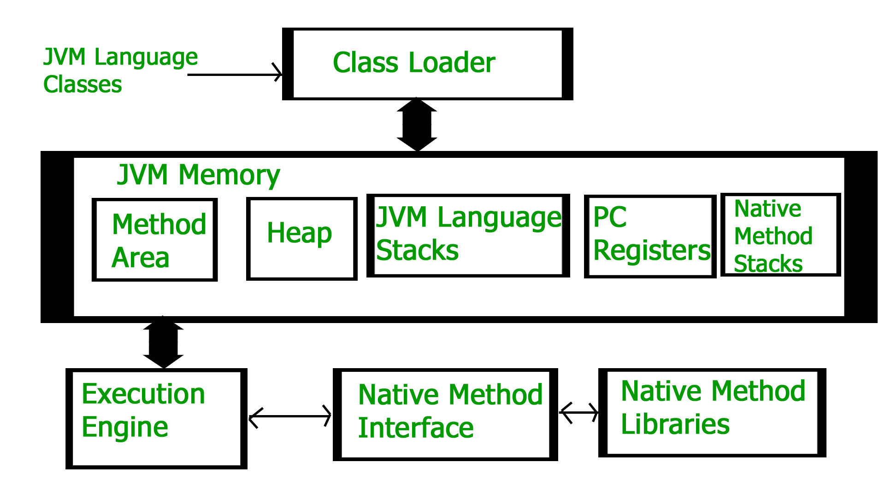
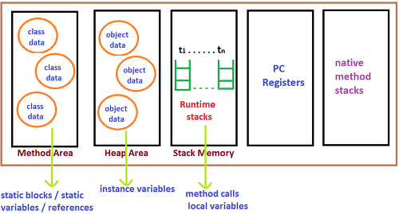

# java-was-2022
Java Web Application Server 2022

## 프로젝트 정보 

이 프로젝트는 우아한 테크코스 박재성님의 허가를 받아 https://github.com/woowacourse/jwp-was 
를 참고하여 작성되었습니다.

### 프로젝트 구조
    ./src/main/java
    ├── customException
    │   ├── AlreadyHasSameIdException.java
    │   └── cannotLogIn
    │       ├── CannotLogInException.java
    │       ├── NotFoundUserException.java
    │       └── PasswordMismatchException.java
    ├── db
    │   ├── UserIdSession.java
    │   └── mysql
    │       ├── DB_Board.java
    │       └── DB_Users.java
    ├── model
    │   ├── Article.java
    │   └── User.java
    ├── utils
    │   └── SessionIdGenerator.java
    └── webserver
    ├── RequestHandler.java
    ├── WebServer.java
    ├── constants
    │   ├── InBody.java
    │   └── Paths.java
    ├── controller
    │   ├── Controller.java
    │   ├── ControllerMapper.java
    │   ├── DynamicFileController.java
    │   ├── HomePathController.java
    │   └── StaticFileController.java
    ├── httpUtils
    │   ├── Request.java
    │   ├── RequestGetter.java
    │   ├── Response.java
    │   ├── ResponseSender.java
    │   └── entity
    │       ├── Body.java
    │       ├── Header.java
    │       ├── ReqLine.java
    │       └── ResLine.java
    └── service
        ├── AlreadyLoggedInService.java
        ├── ArticleListService.java
        ├── InvalidAccesstoUserListService.java
        ├── LogInService.java
        ├── PostNewArticleService.java
        ├── Service.java
        ├── SignUpService.java
        └── UserListService.java

- customException
  - AreadyHasSameIdException : 이미 디비에 저장된 아이디로 회원가입 요청이 들어올 경우 던져지는 예외.
  - CannotLogInException : 로그인할 수 없을 때 던져지는 예외. 아래 두 클래스는 이 클래스를 상속받는다.
    - NotFoundUserException : 디비에 없는 아이디로 로그인 요청이 들어올 경우 던져지는 예외.
    - PasswordMismatchException : 아이디는 맞지만, 비밀번호가 디비에 저장되어있는 것과 다를 때 던져지는 예외.
- db
  - 유저에 관한 정보와 작성글이 저장되어 있는 디비와 세션
- model
  - User : 유저 관련
  - Article : 유저가 작성한 글
- utils
  - SessionIdGenerator : 세션아이디를 만들어주는 클래스
- webserver : 웹 서버 관련 객체들이 들어있는 패키지
  - controller : 컨트롤러 관련 클래스와 인터페이스가 들어있음
  - httpUtils : http req, res와 그와 관련된 클래스들이 들어있음
  - service : 실제로 서비스가 이루어지는 클래스. 모든 서비스들은 Service 인터페이스를 상속받는다.

### 실행 과정 요약 
- WebServer : 소켓 생성 및 클라이언트 대기
- RequestHandler : http request(이하 요청)를 받고 알맞은 컨트롤러로 요청을 넘김
- Controller : 요청 내용에 따라 서비스 객체에게 서비스를 실행하라고 명령함
  - Service : 요청 내용에 맞는 서비스를 실행한 후 컨트롤러에게 응답(response)함
  - 서비스 객체가 응답을 하면, 컨트롤러는 ResponseSender에게 응답을 클라이언트에게 전해달라고 요청
- ResponseSender : 받은 응답을 클라이언트에게 전송함.

### ERD

- Users : 사용자의 "유저 아이디", "비밀번호", "이름", "이메일" 정보를 저장하는 테이블
- board : 게시물의 "작성자 id(uid X)", "글 내용", "날짜" 정보를 저장하는 테이블

각 테이블의 id는 PK 역할을 함. board의 writerid는 Users의 id를 참조하는 FK임.

## 알게된 것 정리

### HTTP
hyperText인 html을 전송하기 위한 통신규약
- 웹 상에서 클라이언트와 서버 간의 request, response 정보에 대한 프로토콜
- connectionless
- stateless
- tcp와 udp를 사용하며, 80번 포트

### HTTP 동작방식

1. 사용자가 브라우저에 URL을 입력한다.
2. 브라우저가 request 메시지를 보낸다(http request)
3. 서버는 메시지를 바탕으로 정해진 일을 수행한다.
4. 서버가 response 메시지를 보낸다(http response)
5. 브라우저가 메시지를 바탕으로 일을 처리한다.

(실제로는 DNS 처리도 이뤄져야 함)

### HTTP Request
HTTP Request Message = Request Line + Request Header + Request Body

- Request Line

  요청 메소드 + 요청 URI + HTTP 프로토콜 버전으로 이루어져 있음.
- Request Header

  key:value값으로 메타데이터들이 전달됨.

  [헤더 key:value 정보](https://developer.mozilla.org/ko/docs/Web/HTTP/Headers)
- Body

    해당 request의 실제 내용. GET, HEAD, DELETE, OPTIONS처럼 리소스를 가져오는 경우 바디가 없기도 함.

### HTTP Response
HTTP Response Message = Status Line + Response Header + Response Body

- Status Line
  - HTTP 버전
  - Status code: 응답 상태를 나타내는 코드. [HTTP Status Code](https://developer.mozilla.org/en-US/docs/Web/HTTP/Status)
  - Status text: 응답 상태를 간략하게 설명해주는 부분.

- Response Header
    
    request header와 거의 동일
  
    [헤더 key:value 정보](https://developer.mozilla.org/ko/docs/Web/HTTP/Headers)
  
- Body

    request body와 거의 동일. 데이터를 전송할 필요가 없는 경우 마찬가지로 body가 존재하지 않음

### 자바 웹 프로젝트 상대경로에 대하여
웹 백엔드 개발 시, 프론트엔드에서 사용하는 경로의 루트가 벡엔드에서 사용하는 루트와 다름에 주의하자.
- IDE에서 보이는 경로
 

- 프론트엔드에서 보이는 경로

[사진 출처](https://myblog.opendocs.co.kr/archives/436) 현 프로젝트의 구조와 다릅니다. 참고용으로만 보시길 바랍니다.

전자의 루트는 IDE에서 보이는 프로젝트 폴더이지만, 후자의 루트는 정적파일들이 들어있는 폴더이다.

### html에서 자동 redirect
html 문서의 head에서 meta태그 안에 다음과 같은 정보를 주면 해당 파일이 브라우저에 띄워진 후, 명시된 곳으로 redirect된다.

### HTTP code 30x을 사용한 redirect
서버가 브라우저에게 HTTP res code를 300번대로 지정하고, Location에 원하는 경로명을 value로 넣은 후 전송하면

브라우저가 정보를 해독해 다시 request를 보낸다. 서버에서는 이를 처리하여 알맞은 html파일을 브라우저에 전송하면 redirect의 효과를 얻을 수 있다.

자주 사용하는 300번대 code + text
- 301 Moved Permanently

  영구적으로 주소가 이동한 경우
- 302 Found

  브라우저가 요청했던 uri가 일시적으로 변경된 경우

302 Found 메시지가 어떤 과정을 거쳐 전달되는지 도식화
[출처](https://m.blog.naver.com/PostView.naver?isHttpsRedirect=true&blogId=netmaniascom&logNo=80138330596)

### 확장자를 마임타입(content type)으로 쉽게 변환하는 법

- Files 클래스의 probeContentType() 메서드
- URLConnection 클래스의 guessContentTypeFromName() 메서드
- MimetypesFileTypeMap 객체의 getContentType() 메서드

### Stateless vs Stateful
- Stateless

Stateless는 과거의 transaction에 대한 기록이나 정보가 없는 것을 의미한다(현재의 transaction이 과거와 독립적임). 각각의 transaction은 마치 처음 일어나는 것처럼 만들어진다. 한 transaction 당 하나의 서비스나 기능을 제공한다(Short-term request).

예를 들자면, 검색엔진을 들 수 있다. 검색창에 타이핑을 하고 엔터키를 눌렀다고 가정하자. 이 과정에서 인터럽트가 발생하거나, 브라우저가 닫히게 되면 사용자는 처음부터 다시 transaction을 만들어야만 한다. 다른 예시로는 자판기가 있다.(single request - single response)
- Stateful

반면에 Stateful은 현재의 transaction이 과거의 transaction의 맥락을 따라 수행되는 것, 즉 과거의 transaction 기록에 영향을 받을 수 있다는 것을 의미한다. 이러한 이유 때문에 stateful app은 사용자로부터 받은 요청을 처리할 때마다 같은 server를 사용한다.

Stateful의  예시를 들자면 이메일을 들 수 있을 것이다. 이메일의 경우 첫 전송을 제외하면 나머지 transaction들은 이전에 송수신되었던 내용 뒤에 답장을 붙이는 식으로 진행된다. 이러한 특성 때문에, 중간에 인터럽트가 발생했다 하더라도 현재까지의 기록을 통하여 적절히 취사선택을 할 수 있다.

[참고자료](https://www.redhat.com/en/topics/cloud-native-apps/stateful-vs-stateless)

### 쿠키와 세션

HTTP는 기본적으로 stateless하다. 그러나 필요에 따라 상태정보를 알고있어야 할 때가 있는데, 이때 사용하는 것이 쿠키와 세션이다. 쿠키와 세션은 모두 여러 페이지들에 걸쳐 사용되는 유저의 데이터를 저장한다는 공통점이 있지만, 사용 목적 등 여러 면에서 다르다.

| 쿠키                                                                           | 세션                                                                                                                     |
|------------------------------------------------------------------------------|------------------------------------------------------------------------------------------------------------------------|
| clinet-side에 저장됨. header에 의해 전송                                              | server-side에 저장됨                                                                                                       |
| 사용자의 브라우징 기록이나 장바구니 정보 등을 저장하기 위해 사용. 원할 때 활성화/비활성화 가능                   | 다수의 페이지들에 걸쳐 사용되는 정보를 일시적으로 저장하기 위해 사용 log-in시 초기화되며, log-out시 없어짐(session이라 불리는 이유) 서버 시스템이 shut-down될 때도 없어짐 |
| 문자열 타입의 데이터만 저장할 수 있음                  .  한 쿠키 당 최대 4KB                  | 사용자의 정보는 세션 변수에 저장되며, 어떤 형태의 정보(혹은 파일)든 저장할 수 있음. 원하는 만큼 저장 가능                                                     |
| local에 저장되어있고, 브라우저에 그대로 노출됨.  허가받지 않은 유저가 사용자 시스템에 접근할 수 있을 경우 보안에 취약함. | 각 사용자에 따라 다른 세션정보를 가짐. (각 유저는 sessionID에 의하여 식별됨)      . 쿠키에 비해 보안성이 높음.                                               |

쿠키로 구현된 세션의 동작 방식
(이 경우, '세션은 쿠키에 종속적이다'라고 표현함)

### Daemon(데몬) 프로세스란?

데몬 프로세스란 서비스 요청에 응답하기 위해 background에서 장기간 실행되는 프로세스를 의미한다. 유닉스에서 비롯된 용어이지만, 다른 운영체제에서도 같은 의미로 사용되는 경우가 많다.
유닉스에서는 보통 뒤에 -d를 붙혀 이름을 짓는 경우가 많다.

ex) inetd, httpd, nfsd, sshd, named, and lpd

이때 백그라운드에서 실행되는 프로세스란, 입력장치 및 터미널과의 관계를 끊은 프로세스를 말한다고 보면 된다. 사용자의 키보드 입력과 상관 없이 스스로 돌아가는 프로세스이다.
(이 프로젝트에서는 mysql을 데몬 프로세스로 설정하였다.)

[출처](https://kb.iu.edu/d/aiau)

[참고](https://blogger.pe.kr/770)

### JVM이란?
Java bytecode로 컴파일될 수 있는 언어로 구현된 프로그램을 컴퓨터가 실행시킬 수 있도록 해주는 가상머신(소프트웨어)

### JVM의 동작과정
.java 파일은 컴파일러에 의해 .class 파일로 변환됨. 이 클래스 파일들은 프로그램 실행 시 다음과 같은 일련의 과정을 거침

- 간소화된 버전

### Class loader
클래스로더는 Loading, Linking, Initialization이라는 세 가지의 임무를 맡고 있음
- **Loading** : 
.class 파일을 읽고, 각 파일에 맞는 이진 데이터를 만들어 메서드 영역에 저장함. 각각의 데이터들은 다음과 같이 나타남
  - 클래스의 이름과, 바로 위 부모클래스의 이름(정규화; FQCN - Fully Qualified Class Name)
  - 각 .class 파일이 클래스인지, 인터페이스인지, 열거체인지
  - 제어자, 변수, 메서드 정보 등등
  
[Loading 과정의 세부사항(참고)](https://tecoble.techcourse.co.kr/post/2021-07-15-jvm-classloader/)

로딩이 끝나면, JVM은 각 파일에 맞는 Class 타입(java.lang)의 오브젝트를 만들어 힙 영역에 저장한다.

- **Linking** : 증명(verification), 준비(preparation), 해결(resolution) 수행
  - 증명 : .class 파일이 올바른 컴파일러에 의해 적절히 format되고 생성되었는지 검사.
  - 준비 : static 변수들을 할당하고 default 값으로 초기화.
  - 해결(optionally) : 메서드 영역의 런타임 환경풀을 통하여 Symbolic reference를 Direct reference로 replace.

  [Symbolic references와 Direct references에 관한 글(참고)](https://topic.alibabacloud.com/a/java-virtual-machines-symbolic-references-and-font-colorreddirectfont-reference-understanding_1_27_30293654.html)
- **Initialization** : 모든 static 변수들이 코드상에 있는 값(혹은 block)으로 초기화됨. 코드 상 top-down으로 진행되고 부모를 먼저 초기화한 후 자식이 초기화됨.

### JVM 메모리

- **메서드 영역** : class level의 모든 정보(이름, 부모이름, 메서드, 변수). static 변수의 경우 java 8부터 힙 영역에 저장됨
- **힙 영역** : new로 생성되는 객체들이 저장됨
- **스택 영역** : 스레드마다 생성되는 스택들이 저장됨. 스택은 activation record/stack frame으로 이루어져 있으며, 하나의 프레임마다 메서드 호출정보(지역변수 등)가 저장되어 있음.
스레드가 종료되면 JVM에 의해 해당 스택이 파괴됨.
- **PC Registers** : 스레드마다의 pc 값 저장
- **Native 메서드 스택** : native method를 호출하는 코드를 수행하기 위한 스택(c, c++ 등)

### JVM Execution Engine
메모리 영역들과의 소통을 통해 바이트코드를 한줄씩 수행하는 부분. 크게 인터프리터와 JIT 컴파일러, GC 3개의 하위 컴포넌트로 구분지을 수 있다.

[각 영역에 대한 설명(참고)](https://www.tutorialspoint.com/What-is-execution-engine-in-JAVA)

- JVM을 학습하고 나서 생각해볼 것들
  - 바이트코드는 어디에 저장되나?
  - 정적변수는 어디에? 언제?
  - 인스턴스 변수는 어디에? 언제?
