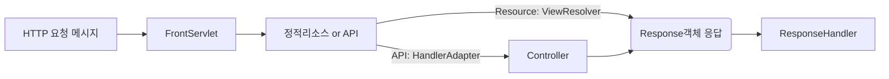

# java-was-2022
Java Web Application Server 2022
## 프로젝트 정보 
이 프로젝트는 우아한 테크코스 박재성님의 허가를 받아 https://github.com/woowacourse/jwp-was 
를 참고하여 작성되었습니다.

현재 WAS 프로그램의 동작 구조이다.

1. 모든 HTTP 요청 메시지는 Request객체로 반환되어 FrontServlet의 인자로 들어간다.
2. FrontServlet은 정적 리소스인지 API인지 여부를 확인하여 resources에 존재하면 바로 내려주고, 없다면 HandlerAdapter로 들어간다.
3. HandlerAdapter는 API를 도메인별로 분류하여 알맞은 컨트롤러를 매핑해준다. 현재는 User 도메인만 존재하기 때문에 어댑터는 하나만 있으나 확장성을 고려하였다.
4. UserHandlerAdapter는 각 API별로 나누어진 컨트롤러 (UserCreate, UserLogin, UserLogoutController ...) 중 요청 URL을 보고 알맞은 컨트롤러를 매핑해준다.
5. 컨트롤러와 서비스는 로직을 수행한다.
6. 정적 리소스는 어댑터 대신 ViewResolver를 통해 알맞은 리소스를 찾는다.
7. 모든 컨트롤러 혹은 뷰 리졸버는 반드시 알맞은 응답에 필요한 데이터를 가지고 있는 Response 객체로 응답한다.
8. Response객체는 ResponseHandler의 인자로 들어가 클라이언트로 응답한다.

### 적절한 API 및 리소스 호출 원리
FrontServlet이 적합한 도메인의 어댑터를 찾는 과정, 도메인어댑터가 적합한 컨트롤러를 호출하는 방법에 리플렉션 기술을 적용하진 않았으며, Map을 통해 각 API단위로 나뉘어져 있는 컨트롤러에 도달하게 된다. 아래는 UserHandlerAdapter의 생성자 코드이다.
```java
public UserHandlerAdapter() {
        controllerMap.put("/user/create", new UserCreateController());
        controllerMap.put("/user/login", new UserLoginController());
        controllerMap.put("/user/list", new UserListController());
        controllerMap.put("/user/logout", new UserLogoutController());
    }

```


### 예외 처리
- WasException : WAS 프로그램에서 구현된 모든 custom exception이 확장하고 있는 부모 클래스
- DuplicateUserIdException : 회원가입 시 중복된 유저 아이디에(PK) 대해 예외 발생
- UserNotFoundException : 로그인 시 아이디, 패스워드에 해당하는 유저가 없을 경우 예외발생, 발생시 login_failed.html로 이동
- SessionNotFoundException : 쿠키에 있는 세션 아이디와 일치하는 세션이 존재하지 않을 경우에 대한 예외 처리
- SessionExpiredException : 세션이 만료된 경우에 대한 예외 처리 (현재 expire date는 세션 생성 후 30분 후로 지정되어 있음.)

## 프로젝트 수행 과정
### Step 1 - index.html 응답
최초의 상태는 localhost:8080으로 접속 시에 "Hello World"를 출력해준다. 이는 구현되어 있는 responseBody 메서드에 해당 문구를 byte[]로 변환하여 응답해주기 때문이다.

응답으로 index.html을 넘겨주는 방식으로 개선하기 위해서는 
1. 서버로 들어오는 inputLine에서 해당 url을 parsing
2. parsing한 파일을 resources에서 찾아 byte[]로 변환
3. 이를 response body에 write

의 과정을 거쳐야 한다.
index.html에 대한 HTTP Request 메시지의 첫 라인은 **GET /index.html HTTP/1.1**이다. 이것을
1. split메서드를 통해 "/index.html"만을 parsing
2. "index.html"이 있는 resource 디렉토리를 붙인 절대 경로로 Files.readAllBytes() 메서드의 인자로 넘겨 불러와 byte[]로 변환
3. 이를 response body에 write

하여 해결 가능하다.

### Step 2 - GET으로 회원가입
현재 회원가입은 http://localhost:8080/user/create?userId=aa&password=bb&name=cc&email=dd@dd 의 예처럼 쿼리스트링으로 전송된다. 실제 웹 서버에서는 이보다 훨씬 더 많은 종류의 요청 메시지를 처리해야 하지만, 현재 요구사항대로 GET요청으로 들어오는 회원가입을 처리하는 것에 집중하였다. 요구조건을 만족하기 위해 필요한 과정은 아래와 같다.
1. url에 쿼리스트링 존재 여부를 판단하여 쿼리스트링만을 추출
2. 추출된 쿼리스트링을 각 파라미터 별로 파싱
3. 파싱된 파라미터들을 서비스레벨로 넘겨 디비에 저장
4. 적절한 응답 (대체로 회원가입 시 302 redirect를 통해 적절한 페이지로 리다이렉트되도록 구현한다.)

1번과 2번의 과정은 String 클래스에서 제공하는 split 메서드를 통해 수행할 수 있었다. 이보다 고민이 되었던 부분은 크게 두 가지 였는데
하나는 유저정보를 저장하는 로직을 어떤 구조로 설계하는 것이 객체지향적이고 유지보수가 편할 것인지 였고, 다른 하나는 상황마다의 응답을 어떻게 구현할 것인가였다.

### 회원가입 로직 설계 (Request 객체 생성, Service 레벨 분리)
우선 요청에 대한 정보를 String 형태의 url을 계속 사용하는 것보다 Request 객체가 url 및 Requet parameter 정보, 추후 요청 메서드 정보 등을 캡슐화하여 가지고 있는 것이 적합하다고 판단하여 **Request객체를 추가**하였다. 서비스레벨로 Request객체를 넘기고 응답 메시지 작성 때도 단순히 url만 넘기지 않고 객체를 넘겨주어 다양한 처리가 가능할 수 있도록 설계하였다.

또한 User회원가입에 대한 디비 저장 로직을 위해 **UserService를 분리**하였다. 컨트롤러에 대해서도 고민하였으나 현재 User외에 다른 도메인이 존재하지 않고 요구사항의 로직도 단일하여 아직 큰 필요성을 느끼지 못했다. 따라서 더 이상 구현을 추가하지 않고 추후 웹서버의 다양한 요구조건이 생기면 처리할 예정이다. 다만 설계에 대한 고민은 계속 진행중이며 추후 요구사항이 추가됨에 따라 변경의 여지가 많아 계속해서 수정해나갈 예정이다...

### 적절한 응답 (ResponseHandler클래스 구현)
우선은 기존 RequestHandler에서 응답의 역할을 별도의 클래스로 분리해야 할 필요가 있었다. ResponseHandler는 다양한 경우에 맞는 적절한 응답을 내려주는 역할을 한다. 
이제 RequestHandler는 요청에 대한 자신의 역할이 끝나면 해당 소켓과의 `connection`을 ResponseHandler에 생성자 주입해준다. 응답 메시지 출력을 위한`DataOutputStream`은 ResponseHandler 객체에서 생성되며, RequestHandler가 request 객체를 인자로 응답핸들러의 `response()`를 호출하면 응답메시지 작성을 시작한다.

현재 구현된 응답 메시지의 상태는 **200 OK, 302  REDIRECT, 404 NOT FOUND 이며, 이는 enum으로 처리**되어 있다. 302 여부는 Request객체에서 파라미터를 담고 있는지로 확인하며 존재하는 경우, index.html로 리다이렉트시켜준다. 404응답은 요청 URL에 해당하는 리소스가 존재하지 않는 경우 응답하는데, 이는 후술할 ViewResolver에서의 렌더링에 실패하여 발생하는 exception을 catch하여 이때 에러로그를 찍는 과정에 404응답 메시지를 보내는 로직을 추가하는 방식으로 구현하였다. 에러 페이지를 만들어보려고도 하였으나 브라우저가 상태코드가 404이면 바디 내용은 보여주지 않는 것 같아 구현하지 못했다. 이에 대한 구체적인 코드는 아래와 같다. 적합한 파일을 찾아 exception이 발생하지 않으면 200응답, 찾지 못했다면 404 응답이다.

```java
try {
        Path path = viewResolver.findFilePath(request.getUrl());
        String contentType = Files.probeContentType(path);
        byte[] body = viewResolver.findActualFile(path);

        response200Header(dos, body.length, contentType);
        responseBody(dos, body);
    } catch (IOException e) {
        response404Header(dos);
        logger.error("404 NOT FOUND : " + e.getMessage());
    }
```
## Step 3 - stylesheet 지원

전체적인 과정은 추후 작성 예정이며, 우선 stylesheet가 항상 정상적으로 동작하기 위해 만든 ViewResolver 제작 과정을 기술하였다.

### ViewResolver 제작기
결국 모든 경우에 적절한 리소스를 내려줄 수 있는 역할을 수행할 수 있어야 한다는 생각에 ViewResolver를 따로 만들었다. 부족한 Spring MVC 지식으로 spring 뷰 리졸버와 역할이 비슷하다고 생각해서 이렇게 지었는데 네이밍이 이상하다는 피드백이 있다면 고칠 예정.. 

목표는 요청 url이 내려오면 static, templates 디렉토리에 상관없이 일관되게 리소스를 내려주는 것이었다. **단, url의 특정 정보, 예를 들어 확장자나 디렉토리 등에 종속되어 조건이 분기되어서는 안된다.** 예를 들어, 현재 css나 js는 static 디렉토리에 존재하는 반면, html은 templates에 존재한다. 그렇다고 해서 css 확장자 -> static에서 찾기, 이런 식이나 css면 css/style.css 이렇게 저장하기 이런 종속적인 규칙이 발생해서는 안된다. 

여기까지 하고 보니까 url을 일일이 파싱하고 붙이는 작업으로는 이 로직을 수행할 수 없을 것 같다는 생각이 들었다. 그래서 파일 검색의 로직 자체에 대한 접근 방식을 바꾸었다. 아이디어는 구현 과정에서 리소스를 못내려주는 경우에 대한 에러 로그로 url을 찍어주는 방식에서 찾았다. 로직은 아래와 같다.

[ static 디렉토리에서 뒤져보기 ] -> [찾으면 반환, 없으면 exception] -> [ 바로 catch하여 templates 디렉토리 뒤져보기] -> [찾으면 반환, 없으면 exception ] -> [ 에러 로그 출력 ]

이렇게 url에 대한 처리를 확장자나 디렉토리 위치에 종속되지 않고 시행할 수 있었는데, 다른 문제가 있었다. 해당 메서드는 url을 byte[]로 리턴해주는데, 응답 메시지가 정상적으로 동작하려면 content type도 같이 넣어주어야 한다. content type은 팀원 분께서 `Files.probeContentType(path)` 라는 좋은 정적 메서드를 알려주셔서 file path만 넘겨주면 파일에 해당하는 content-type을 받을 수 있었지만, file path가 필요했다. 따라서 기존 메서드를 파일 경로를 찾아주는 `findFilePath(String url)` 와 실제 파일을 찾아주는 `findFileBytes(Path path)`로 분리하였다.

여기서 findFilePath 메서드를 만드는 과정에서 문제가 있었다.

1. 최초 시도
```java
public Path findFilePath(String url) {  
    try {  
        return new File(ViewResolver.STATIC_PATH + url).toPath();  
    } catch (InvalidPathException e) {  
        return new File(ViewResolver.TEMPLATES_PATH + url).toPath();  
    }  
}
```
이렇게 짜면 당연히 될줄 알았으나 exception이 터지질 않았다. 찾아보니 File 객체 생성자에 url을 넘겨주는 방식은 예외가 터지지 않았다. 결국 지금 필요한 것은 파일 path를 리턴하는 로직이되 해당 파일이 존재하지 않을 시 exception이 발생하는 메서드를 찾는 것이었다.

2. 두 번째 시도 (임시방편)
```java
public Path findFilePath(String url) {
  try {

    Files.readAllBytes(new File(ViewResolver.STATIC_PATH + url).toPath());

    return new File(ViewResolver.STATIC_PATH + url).toPath();

  } catch (IOException e) {

    return new File(ViewResolver.TEMPLATES_PATH + url).toPath();
  }
}
```
임시 방변으로 파일 자체를 찾는 readAllBytes() 메서드를 오로지 exception 용도로 추가하였다. 그러나 이는 실제 파일을 불러오는 메서드와 중복되는 기능이었고 수정이 필요하였다. 

3. 세 번째 시도 (현재)
```java
public Path findFilePath(String url) throws IOException {  
    try {  
        Path path = Paths.get(STATIC_PATH + url);  
        return path.toRealPath(LinkOption.NOFOLLOW_LINKS);  
    } catch (IOException e) {  
        Path path = Paths.get(TEMPLATES_PATH + url);  
        return path.toRealPath(LinkOption.NOFOLLOW_LINKS);  
    }  
}
```
이를 위해 Path interface와 구현체인 Paths 클래스에 대한 javadoc을 찾아보았다. 파일 경로를 리턴하되 찾아보고 없으면 exception이 터질 수 있는 메서드를 찾아보았고 `toRealPath()`를 이용하기로 하였다. 

> toRealPath() 메서드는 실재 파일(existing file)의 실제 경로를 반환한다. 여기서 실제 파일이라는 의미는 파일이 진짜로 있어야 한다는 뜻이다. toAbsolutePath() 메서드를 사용할 때는 실재 파일일 필요가 없다. 변환 과정에서 심볼 링크는 제외하고 싶다면 LinkOption.NOFOLLOW enum값을 전달해야 한다. 상대 경로를 전달하면 절대 경로를 반환하며 파일이 없거나 접근할 수 없다면 IOException 예외를 던진다.   -javadoc 번역

수정된 방식에서는 Path 인터페이스에 구현된 toRealPath() 메서드를 통해 절대경로를 반환하는데 없을 시에는 IOException이 동일하게 발생한다. 심볼릭 링크는 제외하는게 나을 것 같아 제외하였다.

추가적으로 ViewResolver가 정상적으로 작동하는지를 확인하기 위한 테스트 코드를 우선 작성하였고 이를 통해 findFilePath 메서드를 각각 static 디렉토리와 templates 디렉토리로 테스트하였고 통과하였다.

### Step 4 - POST로 회원가입
 기존 GET방식에서 POST방식으로 변경된 회원가입 요구사항을 반영하기 위해 가장 먼저 필요한 것은 HTTP Request 메시지의 바디를 읽어오는 것이었다. 헤더와 바디 사이에는 빈 공백을 가지는 한 줄(line)이 있었고, 추후 다양한 요구사항을 만족하기 위해서는 메시지의 헤더 및 바디에 대한 정보를 가지고 있는 하나의 Request객체가 필요하였다.
로그인 확인 로직.

### Step 5 - 쿠키를 이용한 로그인
 로그인 유지 기술을 구현하기 위해 로그인 시에 세션을 생성하고 응답에 쿠키값을 set하는 로직을 추가하였다. 이후 클라이언트의 요청에는 쿠키헤더에 세션아이디를 가지고 있게 되고, 이를 바탕으로 로그인 유무를 판단한다. 또한, 로그인 유지 기술이라고 한다면 사용자가 원하는 시점에 로그아웃이 되도록 구현해야 하며, 또한 로그인되었다 하더라도 세션이 영원히 지속되지 않고 만료되어 보안 취약점에 노출되지 않도록 하는 것도 중요할 것이다. 이를 만족하기 위한 기능 요구사항은 아래와 같다.

1. 로그인 유무 판단
2. 로그인 유지
3. 세션 만료 혹은 수동 로그아웃 버튼 입력을 통한 로그아웃
4. 로그인 유무 판단에 따른 동적 HTML 응답
 
 이를 위해 클라이언트가 가지고온 세션 아이디가 유효한 세션인지를 판단하는 **AuthInterceptor**를 구현하였다. AuthInterceptor는 util 패키지에 위치하여 모든 클래스에서 전역적으로 호출될 수 있다.

 - 로그인 유무 판단 : Request객체를 인터셉터의 isAuthUser() 메서드 파라미터로 주면, validation 여부를 반환해준다. 여기서 Validation에는 기본적으로 쿠키의 세션아이디와 일치하는 세션을 HashMap 형태로 저장된 스토리지에서 찾고 (존재하지 않으면 SessionNotFound) 찾은 세션의 expire date가 유효한지 판단하여 (유효하지 않으면 SessionExpired) 다 통과하면 valid하다고 판단한다.
 - 로그인 유지 : 로그인이 유지되기 위해 최초 로그인 시 스토리지에 세션이 저장될 때 생성시각과 만료시각을 필드로 저장한다. 사용자는 로그인 후 이름이 우측 상단에 표시됨으로써 로그인이 유지되어 있음을 확인할 수 있고, 애플리케이션은 로그인 유무에 따라 분기가 필요한 로직마다 AuthInterceptor에서 앞서 설명한 로직을 통해 처리한다.
 - 세션 만료 혹은 수동 로그아웃 버튼 입력을 통한 로그아웃 : 만료시각은 현재 생성시각의 30분후로 설정되어 있어 30분후 자동으로 로그인 유지가 끊히도록 구현하였다.
 - 로그인 유무 판단에 따른 동적 HTML 응답 : Step6에서 이어서 설명.
### Step 6 - 동적인 HTML


### Step 7 - 한 줄 게시판 구현


