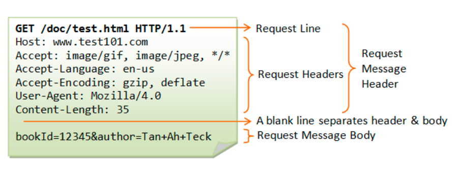

# java-was-2022
Java Web Application Server 2022

## 프로젝트 정보 

이 프로젝트는 우아한 테크코스 박재성님의 허가를 받아 https://github.com/woowacourse/jwp-was 
를 참고하여 작성되었습니다.

### 알게된 것 정리

#### HTTP
hyperText인 html을 전송하기 위한 통신규약
- 웹 상에서 클라이언트와 서버 간의 request, response 정보에 대한 프로토콜
- connectionless
- stateless
- tcp와 udp를 사용하며, 80번 포트
#### HTTP 동작방식

1. 사용자가 브라우저에 URL을 입력한다.
2. 브라우저가 request 메시지를 보낸다(http request)
3. 서버는 메시지를 바탕으로 정해진 일을 수행한다.
4. 서버가 response 메시지를 보낸다(http response)
5. 브라우저가 메시지를 바탕으로 일을 처리한다.

(실제로는 DNS 처리도 이뤄져야 함)

#### HTTP Request
HTTP Request Message = Request Line + Request Header + Request Body

- Request Line

  요청 메소드 + 요청 URI + HTTP 프로토콜 버전으로 이루어져 있음.
- Request Header

  key:value값으로 메타데이터들이 전달됨.

  [헤더 key:value 정보](https://developer.mozilla.org/ko/docs/Web/HTTP/Headers)
- Body

    해당 request의 실제 내용. GET, HEAD, DELETE, OPTIONS처럼 리소스를 가져오는 경우 바디가 없기도 함.

#### HTTP Response
HTTP Response Message = Status Line + Response Header + Response Body

- Status Line
  - HTTP 버전
  - Status code: 응답 상태를 나타내는 코드. [HTTP Status Code](https://developer.mozilla.org/en-US/docs/Web/HTTP/Status)
  - Status text: 응답 상태를 간략하게 설명해주는 부분.

- Response Header
    
    request header와 거의 동일
  
    [헤더 key:value 정보](https://developer.mozilla.org/ko/docs/Web/HTTP/Headers)
  
- Body

    request body와 거의 동일. 데이터를 전송할 필요가 없는 경우 마찬가지로 body가 존재하지 않음

#### 자바 웹 프로젝트 상대경로에 대하여
작성중

#### html에서 자동 redirect
작성중

#### 확장자를 마임타입(content type)으로 쉽게 변환하는 법

- Files 클래스의 probeContentType() 메서드
- URLConnection 클래스의 guessContentTypeFromName() 메서드
- MimetypesFileTypeMap 객체의 getContentType() 메서드